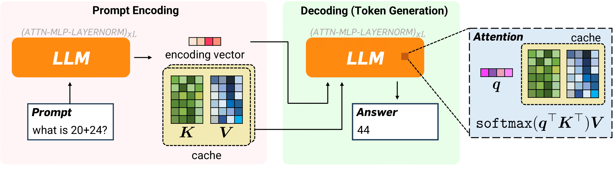
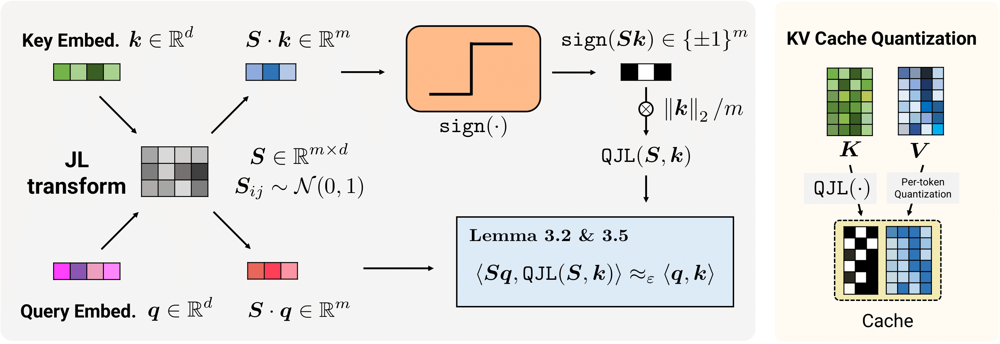
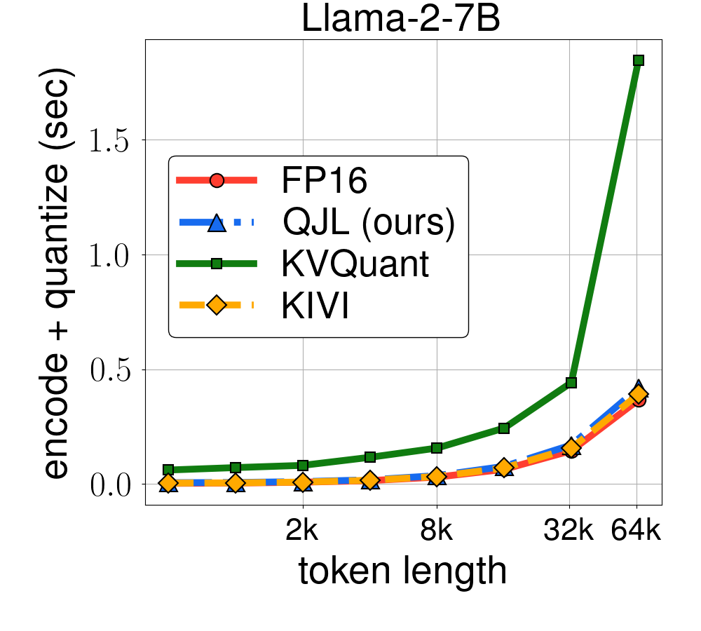
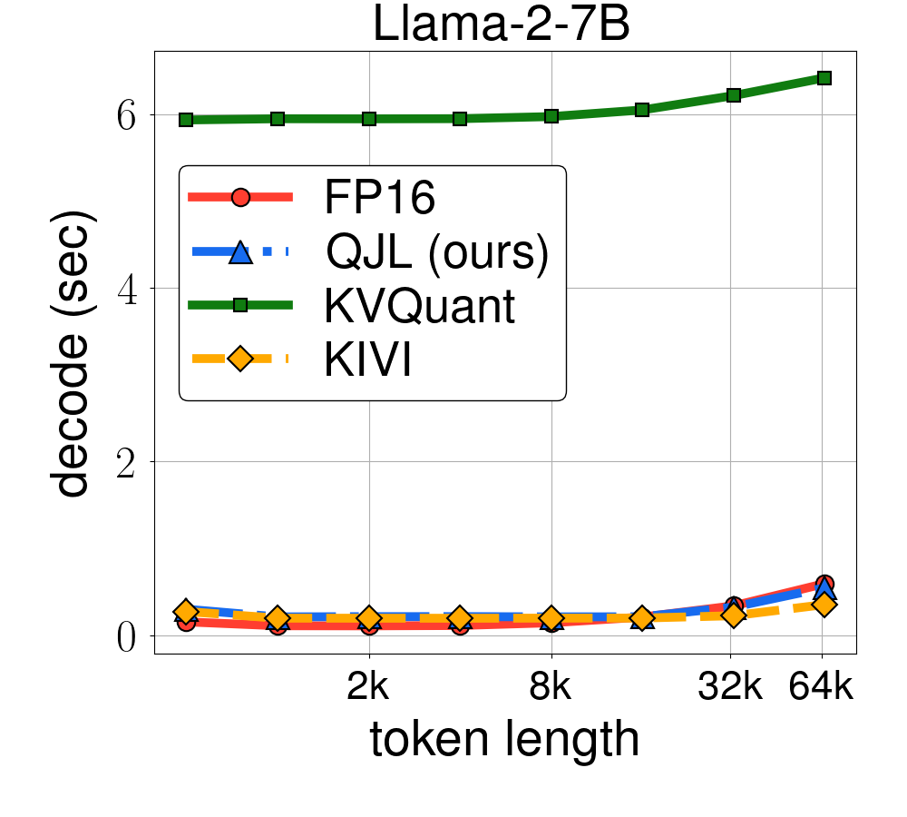
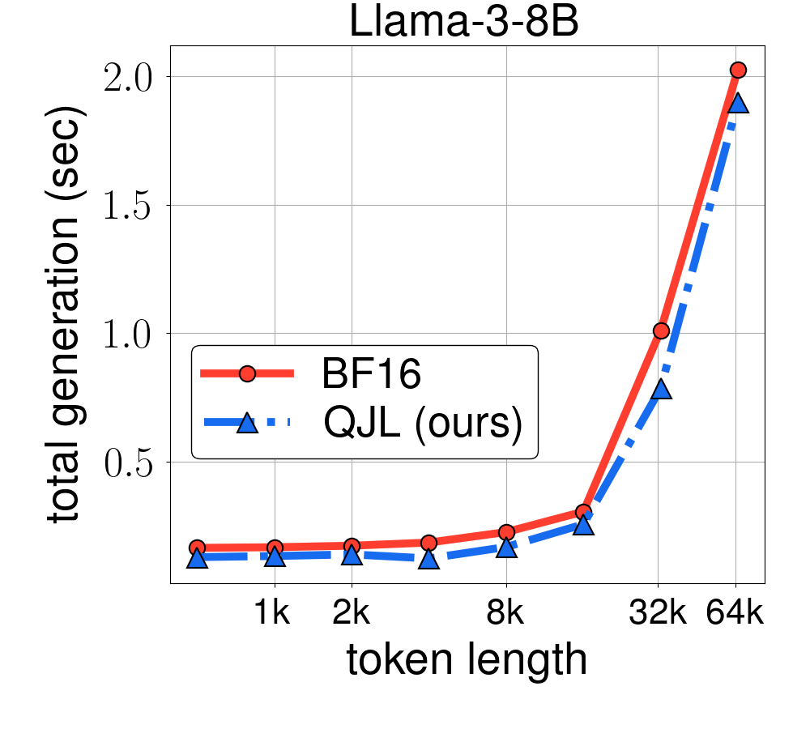

# Memory-Efficient Long-Context LLM Inference via QJL and Adaptive Layer-Wise Compression

**Project:** A-QJL — Layer-group adaptive KV-cache compression extending [QJL (Zandieh et al., 2024)](https://arxiv.org/pdf/2406.03482).

**Authors:** Bhargav Chirumamilla, Xinkai Shen

---

## Overview

This repository extends **QJL** (Quantized Johnson-Lindenstrauss) with **Adaptive QJL (A-QJL)** — a layer-wise allocation of compression strength to improve the quality–memory trade-off at a fixed memory budget.

### Base QJL
QJL applies a Johnson-Lindenstrauss (JL) transform to key embeddings, then quantizes to 1-bit (sign). It uses an asymmetric inner-product estimator for attention scores and avoids per-block quantization constants (“zero-overhead”). This significantly reduces KV cache memory during long-context inference.




QJL achieves provably minimal relative distortion on attention scores, effortlessly handles practical challenges like outlier coordinates in key embeddings, and can be enhanced using orthogonalized JL transforms for improved performance. The method is modular and is specifically designed to be efficient and GPU-friendly, with lightweight CUDA kernels for core operations.
The functional block diagram of QJL is shown below.




Experimental results demonstrate QJL's effectiveness across various LLMs, including Llama-2 and Llama-3, on multiple NLP tasks. QJL achieves a significant reduction in KV cache memory usage (3 bits per float vs. 16 bits) while maintaining or slightly improving accuracy compared to baselines and other quantization methods. It also shows faster runtime, especially for long sequences, and supports different precision formats and grouped query attention, making it compatible with newer LLM architectures. Overall, QJL offers a memory-efficient, fast, and accurate solution for KV cache quantization, addressing a significant bottleneck in serving LLMs, particularly for long-context applications.


## A-QJL Method (Our Extension)

**Idea:** Instead of one fixed projection dimension for all layers, A-QJL divides layers into **3+ groups** and assigns each group a different projection dimension (`k`). Early layers get higher `k` (less compression); later layers get lower `k` (more compression) under a fixed memory budget.

### Group size and k allocation
1. **Layer groups:** Define boundaries, e.g. `[8, 16, 24]` for 32 layers → groups 0–7, 8–15, 16–23, 24–31.
2. **k per group:** Either (a) hand-tune, or (b) use the **sensitivity profiler** to estimate per-layer key variance and allocate `k` proportionally.

### Sensitivity profiler (principled allocation)
```sh
python scripts/sensitivity_profiler.py --model_name "lmsys/longchat-7b-v1.5-32k" \
  --dataset_name qasper --n_calib 10 --num_groups 4 --output config/aqjl_profiled.json
```
This outputs `layer_group_boundaries` and `key_quantization_bits_per_group` for `run_longbench.py`.

### Files
- `scripts/aqjl_experiments.py` — experiment driver (fixed QJL vs A-QJL)
- `scripts/sensitivity_profiler.py` — per-layer sensitivity profiling
- `config/aqjl_experiments_3groups.json` — 3+ group config

---

## Installation
1. Clone the repository:
    ```sh
    git clone https://github.com/Chirumamilla1522/AQJl-Memory-Efficient-Long-Context-LLM-Inference-via-QJL-and-Adaptive-Layer-Wise-Compression.git
    cd AQJl-Memory-Efficient-Long-Context-LLM-Inference-via-QJL-and-Adaptive-Layer-Wise-Compression
    ```

2. Install the required packages:
    ```sh
    pip install -r requirements.txt
    ```

3. Set up the QJL kernel:
    ```sh
    cd qjl_kernel
    python setup.py build_ext --inplace
    ```

## Evaluate QJL on LongBench

QJL supports Llama 2/3 family models (e.g., ``longchat-7b-v1.5-32k``). To evaluate QJL on LongBench:

**2-group mode (fixed QJL):**
```sh
python run_longbench.py --model_name "lmsys/longchat-7b-v1.5-32k" \
    --dtype "float16" \
    --key_quantization_bits 256 \
    --key_quantization_bits_initial_layers 512 \
    --initial_layers_count 15 \
    --outlier_count_general 8 \
    --outlier_count_initial_layers 8 \
    --value_quantization_bits 2 \
    --group_size 32 \
    --buffer_size 128 \
    --seed 42 \
    --dataset_name [dataset_name] \
    --n_data 150
```

**A-QJL 3+ group mode:**
```sh
python run_longbench.py --model_name "lmsys/longchat-7b-v1.5-32k" \
    --dataset_name qasper --n_data 60 \
    --layer_group_boundaries "8,16,24" \
    --key_quantization_bits_per_group "512,384,256,192"
```

### Runtime Evaluation
To produce the runtime experiments from the paper and plot the runtime, sinly run the following command:
```sh
python plot_runtime.py
```
|  |  |  |
|:---------------------------------------------------------------------:|:----------------------------------------------------------------------:|:-----------------------------------------------------:|

## A-QJL Experiments (Layer-Group Adaptive QJL)

This repository includes a reproducible experiment driver to compare:

- `qjl_fixed`: fixed QJL (2 groups: initial vs rest)
- `aqjl`: adaptive QJL with 3+ layer groups and per-group `k`

### 1) Configure experiment
- **2-group mode:** `config/aqjl_experiments.json`
- **3+ group mode:** `config/aqjl_experiments_3groups.json`

### 1b) Optional: run sensitivity profiler first
```sh
python scripts/sensitivity_profiler.py --output config/aqjl_profiled.json
```
Then set `"run_profiler_first": true` in the config calibration section.

### 2) Run experiments
```sh
python scripts/aqjl_experiments.py --config config/aqjl_experiments.json
```

This produces per-run JSON files in `results/runs/` and an aggregate CSV:
`results/aqjl_results.csv`

### 3) Plot and summarize
```sh
python scripts/plot_aqjl_results.py --input_csv results/aqjl_results.csv --out_dir results/plots
```

This creates:
- `results/plots/avg_score.png`
- `results/plots/peak_memory_gb.png`
- `results/plots/tokens_per_sec.png`
- `results/plots/summary.md`

### 4) Dry-run command preview (no model execution)
```sh
python scripts/aqjl_experiments.py --dry_run
```


### Citation
```
@article{zandieh2024qjl,
  title={QJL: 1-Bit Quantized JL Transform for KV Cache Quantization with Zero Overhead},
  author={Zandieh, Amir and Daliri, Majid and Han, Insu},
  journal={arXiv preprint arXiv:2406.03482},
  year={2024}
}
```
